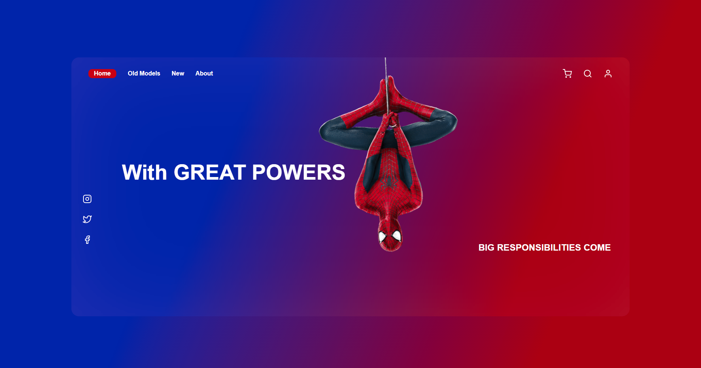

<h1 align="center">Spider Man</h1>

## Descrição do Projeto

Este projeto é uma inspiração do meu herói favorito.

### Skills

<h2 align="center"> 
	 🚀 Projeto concluído com sucesso... 🚀
</h4>

<h3 align="center" style="font-size: 3rem";>Principal tela</h3>

